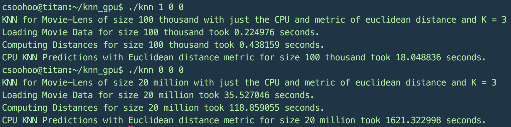
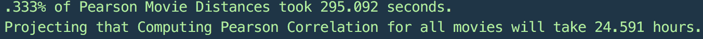
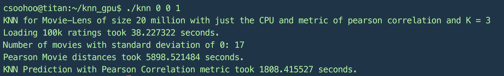
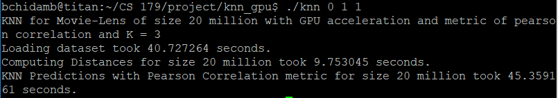

-------------------------------------------------------------------------
GPU-Accelerated KNN: Bhairav Chidambaram and Connor Soohoo
-------------------------------------------------------------------------

    // Do the following for the demo
    // Download the Movie Lens 20m dataset, and put it in the main folder (optional)
    // Run "./knn_TA_script.sh"

-------------------------------------------------------------------------
Motivation:
-------------------------------------------------------------------------
The K-Nearest Neighbors (KNN) algorithm is a supervised machine learning
algorithm that is especially useful in recommender systems. We both looked into
the KNN algorithm when taking the machine learning class CS156b last year
and implementing our blended recommendation system for the Netflix challenge.
However, we found that KNN did not scale well as the the number of examples
or predictors/independent variables increased. We eventually ditched KNN for
faster algorithms that produced more accurate classification results. With our
new knowledge of GPU programming, we plan to revisit the KNN problem
and determine if we can use GPU-acceleration to speed up the algorithm to a
competitive level.

-------------------------------------------------------------------------
Algorithm Overview and Benchmarks:
-------------------------------------------------------------------------
The K nearest neighbors algorithm works with respect to an arbitrary distance metric d.
We are given training data X that contains a collection of features for each movie. There are n movies in the training data.
Then for each data point in the training data we have a label y in set of labels Y that classifies each data point.
For the KNN algorithm, we calculate the given distance metric between each movie (data point) and every other movie in the set.
We use this n x n movie distance matrix to predict the ratings for a given movie-user pair.
To predict a rating for a given movie-user pair, we look at the movie's k nearest movie neighbors that the given user has rated and take a weighted average of the user's ratings to achieve a prediction.
Regardless of the metric, the complexity of predicting over roughly the size of the dataset will always be O(T x n log(n)), with n being the total number of movies and T being the total number of ratings. The T component comes from looping over the movie-user pairings, and the nlog(n) term comes from finding and sorting the ratings that a given user has rated for other movies by their metric weight. This set is at most n large because a user can only rate at most the given n movies.

We use the following two metrics in our KNN algorithm: euclidean distance and Pearson correlation. Euclidean distance between two movies can be calculated by looking at which genres (i.e. features) that each movie is part of. Naively taking the squared differences between all elements (genres) between two given movie vectors is only O(n^2) runtime, and is innately able to be GPU-accelerated. We get the following CPU results when testing on the MovieLens 20 million datasets and with our C++ implementation.
Note that this algorithm would be dramatically slower if we were to implement it in another language like Python.
Also observe that, as expected, the prediction time outscales the metric distance calculation time.

The Pearson's correlation is a more intensive metric to compute and is the more commonly used and useful metric when building recommender systems.
In the recommender system context, the Pearson Correlation between two items, or in this case movies, is defined as the covariance between the movie ratings of the shared common users over the product of the two rating sets' standard deviations.
Originally, we naively computed the correlation for each pair of movies, using the following formula for covariance: cov(X,Y) = E[(X - ux)(Y - uy)].
The runtime of this naive approach is O(T * n), where T is the total number of ratings.
This naive optimization was both less efficient and less conducive to GPU-acceleration because we had to constantly check that a rating was given by a common user inside the inner loop. Below we give the projected naive runtime on Titan's CPU cores for the 20 million dataset.

We decided on implementing some initial CPU optimization of the Pearson correlation calculations first before optimizing using the GPU.
We decided to store the intermediate values of the Pearson correlation as we were iterating through the user loop for any given movie. In other words, we considered a fixed movie X and tried to compute the Pearson correlation between that and all other movies simultaneously.
We accomplish this by iterating over all users who rated movie X and then iterating over all movies that a user in this loop has rated.
We then update the movie correlation row for all such movies.
The runtime of this approach is roughly O(T^2 / m), where T is the total number of ratings, and m is the total number of users.
Below we give the runtime of our optimized CPU KNN with the Pearson correlation distance metric. What once took over 24 hours to complete now finishes in under 2 hours, without even touching the GPU.

Calculating the Pearson's correlation through storing these intermediate values also allows the Pearson's distance metric to be more easily GPU-accelerated. We now go into our approach for accelerating all aspects of KNN using the GPU.

-------------------------------------------------------------------------
GPU Optimizations:
-------------------------------------------------------------------------

Now we describe our optimizations for the GPU implementation of KNN.
The first step is accelerating the distance computation.
For the Euclidean distance metric, this portion of KNN is very easy to parallelize because we can simply spawn separate threads for each entry of the n x n movie distance matrix, and all threads will perform the same computation. 
For the Pearson correlation metric, its a little more complicated.
As we discussed earlier, it is inefficient to compute each entry of the n x n matrix per thread, since this requires computing the shared user set for every pair of movies (overall runtime O(n * T)).
Since we don't have access to STL objects such as vector, map, and set on the GPU, it would also be extremely cumbersome to implement this on the GPU.
To accelerate the Pearson correlation calculations, we use the algorithm described before, and merge the outer movie loop with the loop over , spawning one thread per (m, u) pair.
Effectively, this is just a loop through all entries in our dataset.
To make this straightforward to implement, we divided the calculation into two kernels
    (1) spawn a thread for each entry in the dataset to accumulate the n x n x 6 array of Pearson intermediates (this requires atomicAdd)
    (2) spawn a thread per movie, movie pair in the n x n correlation matrix which processes the 6 Pearson intermediates to obtain the correlation
This is necessary because until we have processed all (movie, user) pairs, we cannot be sure we have reached all users for a given movie.
The resulting speedup from the GPU implementation over the CPU one is over 600x for the 20m dataset.

While this worked for the 100k dataset, we ran into GPU memory constraints for the 20m dataset. 
This is because with 27000 movies, the Pearson intermediate matrix (n x n x 6 x (4 bytes)) will occupy over 18 GB of GPU memory.
To solve this, we split the GPU Pearson correlation calculation over multiple kernel calls

The next step was to accelerate the predictions using the GPU.
Initially, this seemed easy because we can just spawn a different thread for each prediction point.
However, there were a few issues.
First, the prediction step requires sorting all movies rated by a user.
Again, because we don't have access to STL objects, we needed to implement the sorting manually (we used selection sort, to keep it simple).
In addition, we ran into memory issues because of the large amount of memory occupied by each thread.
Unfortunately, there is no way to avoid this, because we must sort the list of movie distances for each query movie and user in order to make a prediction.
Limiting the number of simultaneous threads by reducing the number of blocks and threads per block both to 32 resolved the issue.
Despite this limitation, we still observed a significant speedup for prediction time on the GPU over the CPU (40x speed-up).

Note, it is likely that our distance calculation code and prediction code have non cache aligned global memory accesses.
This is mostly unavoidable because of the nature of KNN.
For example, in the Pearson correlation calculation, the loop will update the Pearson intermediates in an arbitrary order.
In the prediction code, we need to access a small subset of the movie distances which have been rated by a given user.
Because of this, we did not pursue further optimizations.
With more time, we may be able to further optimize the prediction kernel by allowing multiple threads to work on the sorting for one prediction query.

-------------------------------------------------------------------------
Code Structure:
-------------------------------------------------------------------------
All code is located in the src/ directory.
The MovieLensParser .h and .cpp files parse the MovieLens data into the format necessary to proceed with the KNN algorithm.
The KNN .h and .cpp files detail the KNN algorithm, with both euclidean distance and Pearson correlation metrics and the prediction code using the k nearest neighbors.
The KNN_GPU .cuh and .cu files give the KNN formulation but optimized for the GPU.
The main.cpp file takes the users command line arguments and decides which variant of KNN to run (i.e. euclidean distance or Pearson metric) on which dataset (100k or 20mil) and whether to accelerate on the GPU or not.

-------------------------------------------------------------------------
Before Running:
-------------------------------------------------------------------------
Download the larger MovieLens dataset (800 MB) here and move into the main folder:
https://grouplens.org/datasets/movielens/20m/

There should be a folder called ml-20m that contains the ratings.csv file in order to run any of the tests on the 20 million dataset.

-------------------------------------------------------------------------
Usage:
-------------------------------------------------------------------------
Note to TAs: We have provided a shell script which makes our project and runs a few tests. 
All you need to do is run it ("./knn_TA_script.sh")!
First it will check correctness by comparing the CPU and GPU Pearson correlations for the 100k dataset.
Note that in the final predictions, there might be some differences between the CPU and GPU predictions.
This is because when sorting to find the top k movies, ties are broken arbitrarily on the CPU and on the GPU.
Then it will run the GPU code (with Pearson distances) on the 20m dataset and output some of the predictions (assuming you have the 20m dataset downloaded)
Since it takes too long to run the CPU code on the 20m dataset, we have decided not to include it in the TA script.

    // Usage: ./knn is100k gpu pearson k_val verbose
    // For example: ./knn 0 1 0 , ./knn 1 , ./knn 0
    // Or just ./knn for defaults
    // To Run on CPU do: ./knn 0 0 0 or ./knn 1 0 0
    // To Run on GPU do: ./knn 0 1 0 or ./knn 1 1 0
    // To perform correctness test do the following: ./knn 0 2 0 and ./knn 1 2 0
    // This will run both the CPU and the GPU code and test for correctness
    // For the euclidean distance metric, for the pearson correlation 
    // metric, change the third argument from 0 to 1. 

    // is100k = 0,1;    : Use the 100k or the 20mil datasets
    // gpu = 0, 1, 2;   : GPU-acceleration flag, 2 for correction test
    // pearson = 0,1;   : Use Pearson Correlation or Euclidean distance metric
    // k_val = 3        : Desired value of k to search for
    // verbose = 0, 1   : Whether to log debugging output or not

-------------------------------------------------------------------------
Code Output:
-------------------------------------------------------------------------
The images/ subfolder contains screenshots of the various time outputs
of our CPU and GPU variants of KNN with multiple distance metrics.

-------------------------------------------------------------------------
Resources:
-------------------------------------------------------------------------
[KNN Pearson Optimization Blog Post](http://dmnewbie.blogspot.com/2009/06/calculating-316-million-movie.html)

